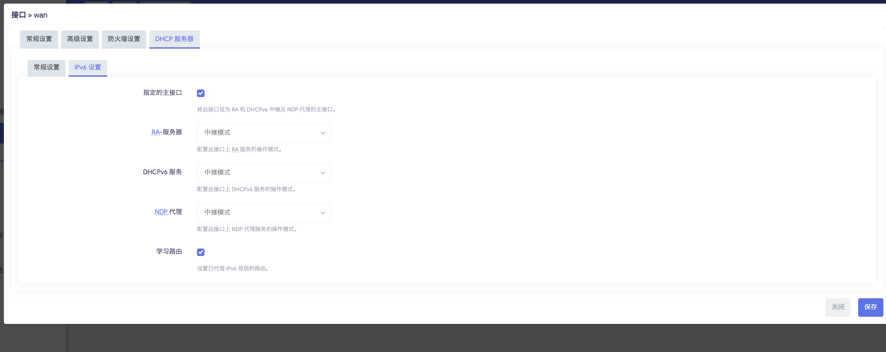

# JDCLOUD AX1800Pro开启ipv6

- 本文章利用CPE设备 `中兴F50` 进行实验

## 1. 进入uboot刷写提供的固件

- 本固件支持passwall，passwall2，openclass，kms，ddns功能


- 更新完成进入配置界面
    - 默认密码 password

## 2.设置wan口

- 进入终端 查看是否识别到 `F50` 设备，正确识别如图所有Device006

```bash
[root@Kwrt:02:15 PM ~] # lsusb
Bus 001 Device 001: ID 1d6b:0002 Linux 6.12.60 xhci-hcd xHCI Host Controller
Bus 001 Device 006: ID 19d2:1353 Unisoc F50
Bus 002 Device 001: ID 1d6b:0003 Linux 6.12.60 xhci-hcd xHCI Host Controller
[root@Kwrt:02:15 PM ~] # 
```

- 设置wan
    - 在网络的接口中，直接粗暴处理，修改wan口为插入的usb设备
    
    
    
    - 这个时候设备就可以联网了
- 修改wan6


**这个时候就会拿到ipv6地址，如果不可以请重启路由器**

- 如图所示，但此时路由器是不具备中继ipv6的能力的


- 接下来开启中继的能力
    - 设置wan6为中继模式
    
    
    
    - 注意和图保持一模一样
    - 接下来设置wan口，和wan6一样 **但是要指定为主接口**
    
    
    
    - 最后一步保存并应用


## 3.检查设备是否支持ipv6


- 成功支持

## 4.问题环节

### 1.为什么要指定wan口为主接口

- 这是要是wan口即成wan6口给lan口的设备下发ipv6地址，和这一个原理相同

> 输入cat /etc/config/dhcp ，（ssh里粘贴怎么操作，复制命令，点击鼠标右粘贴，或者会自动粘贴，下面同样）查看到下图，在config dhcp 'wan'最下面加一行 option master '1'，如图所示，加的这一行命令跟 config odhcpd 'odhcpd'这行中间有回车，空一行，大家空格敲一下，只有配置了这一行，前面的ipv6中继能力才能生效。
> 

### 2.怎么查看usb设备是哪一个网口

- 插拔usb设备，在bash中使用dmseg查看日志发现被注册为eth0

```bash
[  209.080213] usb 1-1: USB disconnect, device number 3
[  209.588278] usb 1-1: new high-speed USB device number 4 using xhci-hcd
[  209.832916] cdc_ether 1-1:1.0 eth0: register 'cdc_ether' at usb-xhci-hcd.1.auto-1, ZTE CDC Ethernet Device, 5c:4d:bf:88:83:23
[  221.187332] usb 1-1: USB disconnect, device number 4
[  221.187515] cdc_ether 1-1:1.0 eth0: unregister 'cdc_ether' usb-xhci-hcd.1.auto-1, ZTE CDC Ethernet Device
[  221.738320] usb 1-1: new high-speed USB device number 5 using xhci-hcd
[  221.959653] cdc_ether 1-1:1.0 eth0: register 'cdc_ether' at usb-xhci-hcd.1.auto-1, ZTE CDC Ethernet Device, 5c:4d:bf:88:83:23
[  222.222966] usb 1-1: USB disconnect, device number 5
[  222.223117] cdc_ether 1-1:1.0 eth0: unregister 'cdc_ether' usb-xhci-hcd.1.auto-1, ZTE CDC Ethernet Device
[  222.758314] usb 1-1: new high-speed USB device number 6 using xhci-hcd
[  223.016554] cdc_ether 1-1:1.0 eth0: register 'cdc_ether' at usb-xhci-hcd.1.auto-1, ZTE CDC Ethernet Device, 5c:4d:bf:88:83:23
```

## 5.如果外网访问记得开关防火墙